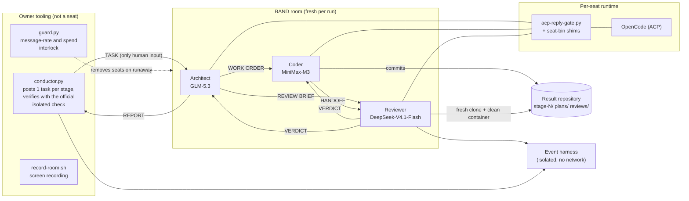
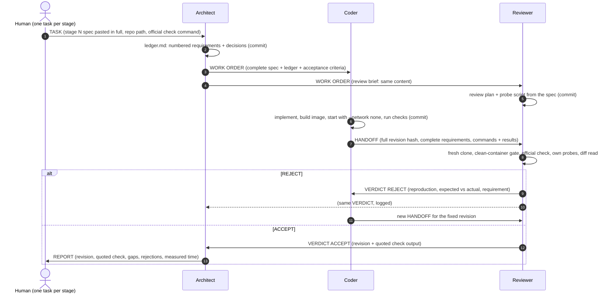

# FACTORY.md — the three-seat dark factory

This file and [`mandates/`](mandates/) are everything another team needs to stand this factory up
and point it at a different problem. Nothing in the mandates is specific to this track; every
track detail travels in the per-stage task message the human (here: the owner conductor) posts into the room.

## 0. Architecture at a glance



## 1. The seats

| Seat | Band handle | Harness | Model (Nebius Token Factory) | Owns | Never does |
|---|---|---|---|---|---|
| **Architect** | `@fahmi24trk/architect` | OpenCode 1.18.34 | `nebius/zai-org/GLM-5.3` | requirements ledger, decisions, work orders, acceptance, the REPORT to the human | write product code, tests or build files |
| **Coder** | `@fahmi24trk/coder` | OpenCode 1.18.34 | `nebius/MiniMaxAI/MiniMax-M3` | implementation, Dockerfile, RUN.md, its own tests | accept its own work |
| **Reviewer** | `@fahmi24trk/reviewer` | OpenCode 1.18.34 | `nebius/deepseek-ai/DeepSeek-V4.1-Flash` | independent verification from a fresh clone, the ACCEPT/REJECT verdict | fix the code it reviews |

Three different model families on purpose: the Reviewer does not share the Coder's blind spots,
and the Architect (the only seat that reads and restates the whole specification) runs the
strongest planner.

## 2. Who talks to whom



Routing rules that make this work unattended (all in the mandates' "Band protocol"):
- Every message is one of seven kinds — `WORK ORDER`, `HANDOFF`, `VERDICT`, `QUESTION`, `ANSWER`,
  `BLOCKER`, `REPORT` — and names, by literal `@owner/handle`, only the seats that must act on it.
- Messages carry the whole content (the specification is concatenated into the message file with
  shell commands, never retyped or summarised); long content is split into numbered parts.
- Questions go to the Architect, never to the human. The human hears from the band once per stage.

## 3. How the factory catches and recovers from bad work

| Layer | Mechanism |
|---|---|
| Requirements | The Architect turns the spec into a numbered, testable **ledger** with an "Ambiguities and decisions" section *before* code exists; the ledger, not the shipped checks, defines done. |
| Independent test design | The Reviewer gets the same brief in parallel and writes its probe plan from the spec, so verification is not derived from the Coder's reading. |
| Clean-room gate | The Reviewer verifies a **fresh clone of the handed-off commit** (an uncommitted file does not exist), builds the image and starts it with `--network none --cpus 2 --memory 2g` before anything else. |
| Official check | The Reviewer runs the event harness exactly as the task gives it (isolated mode) and quotes the summary lines. An errored or skipped run is a failure. |
| Diff read | Special cases for check inputs, files outside the work item's folder, secrets, run-time network use, later-stage features: each is a REJECT finding. |
| Escalation | Third REJECT of the same criterion → the Architect splits the item, changes the approach or records a known gap with evidence. |
| Evidence trail | Plans in `plans/`, review reports in `reviews/`, one commit per step under each seat's own git identity (`Architect`, `Coder`, `Reviewer` @factory.local); history is never rewritten. |

## 4. Runtime engineering: the ACP reply gate

Band posts an owned runtime's final assistant text as a reply to whoever woke it, and that reply
wakes the other seat. In the development runs the models, told to "end silently", wrote
"Silent turn." or "(no reply needed)" instead — and two seats acknowledged each other ~10,000 times
in 43 minutes, burning ~$156 of model credit (each wake re-sends a ~117K-token context).

The fix has two halves:
1. **Protocol:** every turn ends with the literal final response `NO_REPLY`; everything a seat has to
   say goes out through the send command.
2. **Mechanism:** [`runtime/acp-reply-gate.py`](runtime/acp-reply-gate.py) — a ~160-line transparent
   stdio proxy between Band (`jamd`) and `opencode acp`, installed as the seats' spawn command. It
   forwards every ACP JSON-RPC line unchanged except assistant text chunks, which it holds until the
   end of the turn and delivers only if the turn made tool calls and its final text is a protocol
   message, and then only the text after the turn's last tool call. Everything else (`NO_REPLY`,
   "received", narration, leaked `</think>` tags) is dropped and logged, so Band settles the inbound
   message silently. It never alters tool calls, tool output or the room log.
3. **Continuation:** a turn that ends in prose ("Acknowledged, starting now ...") instead of an action or
   `NO_REPLY` would leave that seat idle forever. The gate answers it with a short runtime prompt inside
   the same Band turn ("finish the work, then send your message, or end with NO_REPLY"), at most twice
   per inbound message. The prompt is never posted to the room.
4. **Identity:** the Band CLI on the machine is signed in as the human owner. The gate puts
   [`runtime/seat-bin/`](runtime/seat-bin/) first on every seat's `PATH`; those shims refuse any send
   command that would post without the seat's own session (i.e. as the human) and print the correct
   seat command instead. The submitted run found a gap in these shims (one Coder message went out under the
   human account, see §8); it is fixed in the post-run revision of `runtime/seat-bin/` (§12).

## 5. Standing it up

Prerequisites: Band Desktop ≥ 0.4.10 signed in, Docker, Python 3.12+, Git, OpenCode ≥ 1.18 with a
provider configured in `~/.config/opencode/opencode.json` (never in the repository; the key file is
referenced as `{file:...}`), and the event kickoff checkout with its venv.

```sh
# 1. Install the reply gate as a command the Band daemon can find
ln -sf "$PWD/runtime/acp-reply-gate.py" ~/.local/bin/opencode-gated

# 2. Create the three seats (or: Band Desktop -> New local agent -> OpenCode, approval approve-all)
for seat in architect coder reviewer; do
  band agent create --session $seat --name "${seat^}" --transport opencode \
    --runtime-model "$(sed -n 2p mandates/$seat.md | cut -d' ' -f2)" --runtime-approval approve-all \
    --cwd /abs/path/band-work --instructions-file "$PWD/mandates/$seat.md" --json
  band runtime template set --session $seat --spawn-command "$HOME/.local/bin/opencode-gated"
done

# 3. Fresh result repository + room with the three seats and yourself
factory/new-result-repo.sh /abs/path/band-work/result
factory/new-room.sh            # prints the room id

# 4. Start the interlock and the recorder, then let the conductor run the stages
python3 factory/guard.py <room> --cap-usd <absolute spend cap> &
factory/record-room.sh start final-raw
python3 factory/conductor.py <room> /abs/path/band-work/result --first 1 --last 4 &
#    (manual alternative per stage: factory/make-dispatch.sh <track> <N> <repo> > task.md;
#     band room send <room> "$(cat task.md)" --mention <architect agent id>)
```

Keep every earlier run out of the seats' working directory (the band will otherwise find it).

Seat names must match mandate file names (`Architect` ↔ `architect.md`). Each mandate starts with the
`Harness:` and `Model:` lines the seat actually runs.

## 6. Design choices and what they cost

| Choice | Why | Cost / trade-off |
|---|---|---|
| Three seats, three model families | The Reviewer must not share the Coder's blind spots; the planner reads the whole spec. | Three contexts to pay for; the Reviewer re-reads the handoff instead of trusting it. |
| Architect never writes code | Keeps one seat whose only job is "what does done mean"; its ledger outlives any one implementation. | One extra message hop per stage (~1 min). |
| Reviewer designs probes from the spec, in parallel | Verification is not derived from the Coder's reading of the spec. | ~10-15% of stage spend goes to probes that, when the Coder is right, find nothing. |
| Clean-room gate on a fresh clone | "Works on my checkout" cannot pass: an uncommitted file does not exist, a missing dependency fails the no-network start. | One image build per review round (1-3 min). |
| Full requirements travel in every message | Seats run with bounded contexts and auto-compaction; a handoff that only says "see the spec" loses requirements after a compaction. | Long messages (20-60K chars); cheap compared with a lost requirement. |
| ACP reply gate (`runtime/acp-reply-gate.py`) | Band posts a seat's final text as a reply; without the gate two polite models acknowledge each other forever. Only the text after the last tool call can ever be delivered, and only if it is a protocol message. | ~200 lines of proxy; drops are logged so nothing is silently lost. |
| Turn continuation (in the gate) | A seat that ends its turn with "Acknowledged, starting now..." is never woken again, and the stage stalls forever. The gate answers such a turn with a short continuation prompt inside the same Band turn (at most 2), so the seat finishes its own work. | One or two extra short model calls when a seat narrates instead of acting; the prompt never appears in the room. |
| Fresh work only | Seats share one machine; a capable Architect will happily reuse an earlier run it finds on disk. The mandates forbid it, the task restates it, and the owner keeps earlier runs out of the seats' working directory. | None at run time; it is a discipline for the operator. |
| Seat shims (`runtime/seat-bin/`) | The Band CLI on the machine is signed in as the human; a seat that forgets its send command could otherwise post *as the human*. The shims refuse human-scoped sends and print the correct seat command. | A seat that needs a refused command gets an error and retries the right way. |
| Owner conductor (`factory/conductor.py`) | The human is replaced by a script that does only what the human may do: post the stage task, wait for the REPORT, verify with the official isolated check, post the next task. No nudges are possible. | The run continues unattended overnight; a stalled stage stays stalled (by design). |
| Runaway guard (`factory/guard.py`) | Independent interlock: >16 texts in 2 min, >$5 in 10 min or a total-spend cap removes the seats from the room and stops the runtimes. | Never triggered in the submitted run; it exists because the first rehearsal burned ~$156 in a loop. |
| Owner timebox (`factory/timebox.sh`) | The owner's only lever during a run is to end it: the timebox stops the conductor, the seat runtimes and the recorder at a deadline, after 30 min without seat activity, or when the guard trips. It never posts to the room. | It ended the submitted run at 09:55 WIB, with stage 3 built but unreviewed. |
| 128K context limit in OpenCode | Forces OpenCode's own compaction well before the provider limit, so long stages do not fail on context overflow. | Compaction loses detail, which is why messages carry full requirements. |


## 7. Measured time and model spend (submitted run)

Room `8534579b-da69-4e79-9e34-4a4e2860a91a`, repository `final-result`, factory revision as committed in the owner setup commit.
Times are WIB (UTC+7); spend is Nebius list price computed from OpenCode's token accounting, cache reads
charged at the full input price (upper bound).

| Stage | Scope | Task → REPORT (WIB) | Minutes | Spend | Rejections | Owner isolated check (shipped checks) | Next-stage suite |
|---|---|---|---|---|---|---|---|
| 1 | Reservations | 05:28 → 06:00 | 32.1 | $7.40 | 1 | claimed 1 · S1 120/120 | 0/25 (not fully passed) |
| 2 | Online booking and combined tables | 06:01 → 09:01 | 180.1 | $15.23 | 2 | claimed 2 · S1 120/120, S2 25/25 | 0/7 (not fully passed) |
| 3 | Booking policies, history and recurring reservations | 09:02 → no REPORT (run ended 09:55) | 53.4 | $4.01 | 0 | **in progress, not claimed by the band** (built and handed off by the Coder, never reviewed) · owner evaluation only: S1 120/120, S2 25/25, S3 7/7 | 4/6 (not fully passed) |

**Total: 3 stage task(s) posted, 2 stage(s) accepted by the band and claimed by the owner check, 267 min wall-clock, $26.64 model spend, 3 Reviewer rejections.** Run ended by the owner timebox at 09:55 WIB — no seat activity (spend flat at $239.21, no file changes) for 30 min; no message was sent to the room.

Per seat (whole run): Coder (MiniMaxAI/MiniMax-M3) $19.34 · Reviewer (deepseek-ai/DeepSeek-V4.1-Flash) $5.05 · Architect (zai-org/GLM-5.3) $2.25

## 8. What we tried that failed

| Attempt | What happened | What changed |
|---|---|---|
| "End your turn silently" in the mandates | Models wrote "Silent turn." / "(no reply needed)"; Band posted it; two seats acknowledged each other ~10,000 times in 43 minutes (~$156). | Literal `NO_REPLY` protocol + the ACP reply gate + the runaway guard. |
| Gate v1 (drop only short texts) | OpenCode compaction summaries ("## Objective ...") and long status texts still reached the Architect and woke it. | Gate v3: deliver only if the turn used tools and the final text's first line is one of the seven message kinds. |
| Reviewer chose its own check mode | It ran the harness in host mode (network allowed) and accepted. | Mandate: run the official check exactly as the task gives it; the task prints the isolated command. |
| Send command chained after `cd` | A HANDOFF silently failed (`cd` into a missing folder) and the stage stalled. | Mandate: run the send command on its own and confirm `sent <id>`, else resend. |
| Short handoffs ("see the spec") | After compaction the Reviewer judged against a partial memory of the requirements. | Coder builds the HANDOFF file as header + `cat` of every requirement document. |
| Seat used `band room send` | After forgetting its send command the Coder posted two handoffs with the human's identity. | Seat shims refuse it mechanically; mandates name the seat send form. |
| Prose-ended turn (submitted run, attempt 1) | Stage 1 was accepted, then the Coder answered the stage-2 work order with "Acknowledged. Starting ... Will proceed iteratively" and ended its turn. The gate correctly dropped the prose, so nobody woke the Coder again: a permanent stall at stage 2. A human nudge is forbidden, so the attempt was abandoned. | Gate continuation prompt (max 2 per inbound message) plus a mandate line: never end a turn announcing what you will do. Re-run in a fresh room and repository. |
| Earlier run on disk (attempt 2) | 50 seconds into a fresh run the Architect found the previous attempt's repository in the shared working directory and planned to copy its accepted code. We stopped the run immediately and voided it. | Earlier runs archived outside the seats' working directory, a "Fresh work only" rule in every mandate and in the task message, then a third fresh run. |
| Flaky UI check under load (submitted run, stage 2) | After two REJECTs the Coder spent ~1 h 45 min running the official isolated check in loops (5-30 runs) to chase one browser test that gave 23-25/25 depending on machine load. It fixed the race (wait on the rendered result, drop an auto-search) and the Reviewer accepted at 09:00 WIB, but stage 2 took 180 min. | Nothing changed in the factory; a per-stage time budget in the work order is the obvious next step. |
| Coder posted as the human (submitted run, stage 3) | At 09:21:42 WIB the Coder sent its stage-3 HANDOFF with `jam --profile default --session coder room send ...`. `room send` is Band's human-scoped API even with `--session`, and the shim only refused `band room send` and session-less sends, so the message appears in `room.json` with the human account as sender. Its content is entirely Coder-written; the Coder's tool calls from 09:21:24 to 09:21:42 (in `room.json`) show it composing and sending it. | Post-run fix: both shims refuse `room send` in any word position; noted honestly in §10. |
| Turn ended by context compaction (submitted run, stage 3) | The Reviewer received the HANDOFF, ran 7 tool calls, then OpenCode compacted its context and the turn ended with **empty** final text. The gate only continued prose-ended turns, so the Reviewer was never prompted again and never reviewed the stage-3 commit. The room went idle at 09:24 and the owner timebox ended the run at 09:55. | Post-run fix: the gate also continues a tool-using turn that ends with no text. |
| Band daemon after hours of activity | `jamd` busy-loops at 300-700 % CPU (still functional). | Restarted before the submitted run; reported upstream-worthy, not fixed by us. |

## 9. Honest limits

- The shipped checks are only part of the graded suites; "claimed stage N" is directional. The Reviewer's
  independent probes are what catch spec gaps the shipped checks do not exercise.
- The seat shims are a guard rail, not a sandbox. In the submitted run a seat got past them once (the `jam ...
  room send` gap in §8); a seat could also call the real CLI by absolute path. The room log shows such a post
  under the human account, and its tool calls show which seat sent it, so it is detectable but not prevented.
- The submitted run delivered two accepted stages. Stage 3 was implemented and handed off but never reviewed,
  so the band did not claim it; its owner evaluation numbers are reported separately and labelled as such.
- The conductor and the guard run on the same machine as the band; they are owner tooling, not seats,
  and never post anything except the per-stage task.
- Costs are computed from OpenCode's token accounting at Nebius list prices, with cache reads charged at
  the full input price (an upper bound).

## 10. Rules compliance

| Rule | How this repository meets it | Evidence |
|---|---|---|
| At least three seats, one mandate each, named after the seat, starting with `Harness:` and `Model:` | Architect, Coder, Reviewer; `mandates/architect.md`, `coder.md`, `reviewer.md` | `harness check` output in `docs/test-results/harness-check.txt` |
| Mandates are generic (no track vocabulary) | Every track detail travels in the per-stage task message | `factory/scan_mandates.py` OK; `harness check` gate 4 |
| Two seats exchange @handle messages in both directions | Coder ↔ Reviewer (HANDOFF / VERDICT), Architect ↔ Coder, Architect ↔ Reviewer | `room.json`; `harness check` gate 2 |
| The per-stage task is the only human input | The conductor posted exactly 3 TASK messages and nothing else; no person typed anything into the room. **One more message in `room.json` carries the human account as sender**: the Coder's stage-3 HANDOFF at 09:21:42 WIB, which the Coder posted itself with a human-scoped CLI command (§8). It is seat output, not human input, but we flag it because the sender field says otherwise. | `room.json` (sender types; Coder tool calls 09:21:24-09:21:42), `docs/run-evidence/` |
| Fresh room and fresh repository for the submitted run | Room created 05:27 WIB on 3 Oct 2026; repository initialised with a single owner setup commit before the first task | `git log`, `room.json` |
| No service code written by the owner | The owner commits contain only README/FACTORY/LICENSE, mandates, runtime, factory scripts and docs; every `stage-N/` file was committed by the Coder seat | `git log --format='%an' -- stage-*` |
| Stage folders build and run from a clean container without network, healthy in < 60 s | Checked by the Reviewer at every handoff and by the owner after the run | `docs/test-results/offline-smoke-stage-*.txt` |
| Each stage passes ≥ 50 % of every suite up to its stage and does not fully pass the next stage | Per-stage isolated harness runs | `docs/test-results/SUMMARY.md` |
| No `.git` inside stage folders | Carry-forward copies delete nested metadata | `SUMMARY.md` |
| `room.json` is the whole-room download, no secrets | "Download full session" from the Band console. Scanned for the provider key and common token shapes without printing the key: no key. `harness check` flagged two throwaway session tokens of the service under test (curl probes against a local container); as the participant guide instructs, exactly those two values were replaced with `[REDACTED]` and nothing else was changed | `docs/test-results/secret-scan.txt` (hashes before/after) |

## 11. Run history (honest record)

Only the third attempt is the submitted run. The two earlier attempts used their own fresh rooms and
repositories and were abandoned for factory reasons; nothing from them is in this repository.

| Attempt | Room | Outcome | Why it was abandoned | Factory change |
|---|---|---|---|---|
| 1 | `e2081c96` | Stage 1 accepted (39 min, $8.15, 120/120) | At stage 2 the Coder answered the work order with "Acknowledged, starting ..." and ended its turn. The gate dropped the prose, nobody woke the Coder again, and a human nudge is not allowed: a permanent stall. | Gate continuation prompt; mandate rule against announce-and-stop; gate delivers only post-tool-call text. |
| 2 | `f4e5bd80` | Voided after 50 s | The Architect found attempt 1's repository in the shared working directory and planned to copy its accepted code. Reusing an earlier run defeats the fresh-run rule, so we stopped immediately. | Earlier runs archived outside the seats' working directory; "Fresh work only" rule in every mandate and in the task message. |
| 3 | `8534579b` | **Submitted.** Stages 1 and 2 accepted by the band; stage 3 built and handed off but not reviewed | Not abandoned. It ended when the Reviewer's turn was cut off by context compaction (§8) and the room stayed idle for 30 min; the owner timebox then stopped the run at 09:55 WIB without posting anything. | Post-run fixes in §12 (not used by this run). |

## 12. Post-run factory fixes

The seats ran on the factory exactly as committed in the owner setup commit. Problems found during the run were
fixed **after** it ended (09:55 WIB), in a separate, labelled owner commit dated after the run
(`owner (post-run): factory fixes ...`). It touches only `runtime/` and `factory/`, never a `stage-N/` folder:

- `runtime/seat-bin/jam`, `runtime/seat-bin/band`: refuse `room send` wherever it appears among the first
  command words (option values such as `--session coder` used to shift the words).
- `runtime/acp-reply-gate.py`: a turn that used tools but ended with empty text (for example after context
  compaction) gets the same continuation prompt as a prose-ended turn.
- `factory/guard.py`: closes its database connections and writes a heartbeat every 10 min. The setup copy went
  quiet after hours of polling, so this owner-side fix was applied and the guard restarted at 07:34 WIB
  *during* the run (owner tooling only; no seat, mandate or room message was touched). It never had to trip.
- `factory/timebox.sh`: the owner timebox used to end this run.
