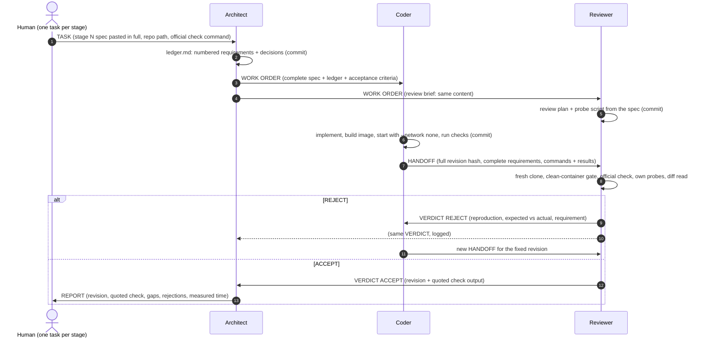

# FACTORY.md — the three-seat dark factory

This file and [`mandates/`](mandates/) are everything another team needs to stand this factory up
and point it at a different problem. Nothing in the mandates is specific to this track; every
track detail travels in the per-stage task message that the human pastes into the room.

## 1. The seats

| Seat | Band handle | Harness | Model (Nebius Token Factory) | Owns | Never does |
|---|---|---|---|---|---|
| **Architect** | `@fahmi24trk/architect` | OpenCode 1.18.34 | `nebius/zai-org/GLM-5.3` | requirements ledger, decisions, work orders, acceptance, the REPORT to the human | write product code, tests or build files |
| **Coder** | `@fahmi24trk/coder` | OpenCode 1.18.34 | `nebius/MiniMaxAI/MiniMax-M3` | implementation, Dockerfile, RUN.md, its own tests | accept its own work |
| **Reviewer** | `@fahmi24trk/reviewer` | OpenCode 1.18.34 | `nebius/deepseek-ai/DeepSeek-V4.1-Flash` | independent verification from a fresh clone, the ACCEPT/REJECT verdict | fix the code it reviews |

Three different model families on purpose: the Reviewer does not share the Coder's blind spots,
and the Architect (the only seat that reads and restates the whole specification) runs the
strongest planner.

## 2. Who talks to whom



Routing rules that make this work unattended (all in the mandates' "Band protocol"):
- Every message is one of seven kinds — `WORK ORDER`, `HANDOFF`, `VERDICT`, `QUESTION`, `ANSWER`,
  `BLOCKER`, `REPORT` — and names, by literal `@owner/handle`, only the seats that must act on it.
- Messages carry the whole content (the specification is concatenated into the message file with
  shell commands, never retyped or summarised); long content is split into numbered parts.
- Questions go to the Architect, never to the human. The human hears from the band once per stage.

## 3. How the factory catches and recovers from bad work

| Layer | Mechanism |
|---|---|
| Requirements | The Architect turns the spec into a numbered, testable **ledger** with an "Ambiguities and decisions" section *before* code exists; the ledger, not the shipped checks, defines done. |
| Independent test design | The Reviewer gets the same brief in parallel and writes its probe plan from the spec, so verification is not derived from the Coder's reading. |
| Clean-room gate | The Reviewer verifies a **fresh clone of the handed-off commit** (an uncommitted file does not exist), builds the image and starts it with `--network none --cpus 2 --memory 2g` before anything else. |
| Official check | The Reviewer runs the event harness exactly as the task gives it (isolated mode) and quotes the summary lines. An errored or skipped run is a failure. |
| Diff read | Special cases for check inputs, files outside the work item's folder, secrets, run-time network use, later-stage features: each is a REJECT finding. |
| Escalation | Third REJECT of the same criterion → the Architect splits the item, changes the approach or records a known gap with evidence. |
| Evidence trail | Plans in `plans/`, review reports in `reviews/`, one commit per step under each seat's own git identity (`Architect`, `Coder`, `Reviewer` @factory.local); history is never rewritten. |

## 4. Runtime engineering: the ACP reply gate

Band posts an owned runtime's final assistant text as a reply to whoever woke it, and that reply
wakes the other seat. In the development runs the models, told to "end silently", wrote
"Silent turn." or "(no reply needed)" instead — and two seats acknowledged each other ~10,000 times
in 43 minutes, burning ~$156 of model credit (each wake re-sends a ~117K-token context).

The fix has two halves:
1. **Protocol:** every turn ends with the literal final response `NO_REPLY`; everything a seat has to
   say goes out through the send command.
2. **Mechanism:** [`runtime/acp-reply-gate.py`](runtime/acp-reply-gate.py) — a 130-line transparent
   stdio proxy between Band (`jamd`) and `opencode acp`, installed as the seats' spawn command. It
   forwards every ACP JSON-RPC line unchanged except assistant text chunks, which it holds until the
   end of the turn and delivers only if the turn made tool calls and its final text is a protocol
   message. Everything else (`NO_REPLY`, "received", leaked `</think>` tags) is dropped and logged, so
   Band settles the inbound message silently. It never alters tool calls, tool output or the room log.

## 5. Standing it up

Prerequisites: Band Desktop ≥ 0.4.10 signed in, Docker, Python 3.12+, Git, OpenCode ≥ 1.18 with a
provider configured in `~/.config/opencode/opencode.json` (never in the repository; the key file is
referenced as `{file:...}`), and the event kickoff checkout with its venv.

```sh
# 1. Install the reply gate as a command the Band daemon can find
ln -sf "$PWD/runtime/acp-reply-gate.py" ~/.local/bin/opencode-gated

# 2. Create the three seats (or: Band Desktop -> New local agent -> OpenCode, approval approve-all)
for seat in architect coder reviewer; do
  band agent create --session $seat --name "${seat^}" --transport opencode \
    --runtime-model "$(sed -n 2p mandates/$seat.md | cut -d' ' -f2)" --runtime-approval approve-all \
    --cwd /abs/path/band-work --instructions-file "$PWD/mandates/$seat.md" --json
  band runtime template set --session $seat --spawn-command "$HOME/.local/bin/opencode-gated"
done

# 3. Fresh result repository + room with the three seats and yourself
scripts/new-result-repo.sh /abs/path/band-work/result
scripts/new-room.sh            # prints the room id

# 4. Per stage: generate the task (spec pasted in full) and post it as the only human input
scripts/make-dispatch.sh <track> <N> /abs/path/band-work/result > task.md
band room send <room> "$(cat task.md)" --mention <architect agent id>
```

Seat names must match mandate file names (`Architect` ↔ `architect.md`). Each mandate starts with the
`Harness:` and `Model:` lines the seat actually runs.

## 6. Design choices and what they cost
(filled from the measured runs below)

## 7. Measured time and model spend
(filled from the submitted run)

## 8. What we tried that failed
(filled)

## 9. Honest limits
(filled)
