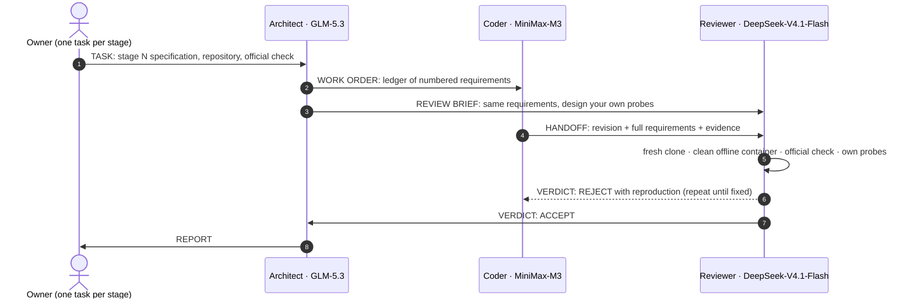

# Tablekeeper — built by a three-seat dark factory

Entry for **WeAreDevelopers × BAND — Dark Factory** (lablab.ai), track **`tablekeeper`**.
Team: Fahmi Harun (solo) · GitHub [`kuker24`](https://github.com/kuker24)

This repository holds a restaurant reservation service, **Tablekeeper**, that was specified by the event
and **built entirely by three AI seats in one BAND room**: an Architect, a Coder and a Reviewer. The human
side of the run was a single task message per stage. No code in `stage-N/` was written by a person, and
nobody nudged, corrected or re-sent anything while the band worked.

> **Submitted run — official harness result: claimed stage 3 (suites 1–3 pass: 120/120, 25/25, 7/7; suite 4 4/6, not fully passed).** The band's Reviewer accepted stages 1–2; stage 3 was committed by the Coder but not reviewed before the run ended (compaction stall). 4.5 h unattended, $26.64 of model spend, 3 rejections by the Reviewer, all from 3 task messages.

## Results

| Stage | Scope | Task → REPORT (WIB) | Minutes | Spend | Rejections | Owner isolated check (shipped checks) | Next-stage suite |
|---|---|---|---|---|---|---|---|
| 1 | Reservations | 05:28 → 06:00 | 32.1 | $7.40 | 1 | claimed 1 · S1 120/120 | 0/25 (not fully passed) |
| 2 | Online booking and combined tables | 06:01 → 09:01 | 180.1 | $15.23 | 2 | claimed 2 · S1 120/120, S2 25/25 | 0/7 (not fully passed) |
| 3 | Booking policies, history and recurring reservations | 09:02 → no REPORT (run ended 09:55) | 53.4 | $4.01 | 0 | claimed 3 · S1 120/120, S2 25/25, S3 7/7 · **not reviewed by the band** (committed by the Coder, Reviewer stalled before reviewing) | 4/6 (not fully passed) |

Pass counts are from the event harness's shipped checks, run by the owner in **isolated mode** (internal
network, no outbound access) on a fresh clone after the run. The shipped checks are only part of the
graded suites. Full outputs: [`docs/test-results/`](docs/test-results/).

| | |
|---|---|
| Wall-clock time | 267 min (05:28 → 09:55 WIB, 3 Oct 2026) (first task → owner end of run) |
| Model spend (Nebius Token Factory, list price) | $26.64 |
| Reviewer rejections that changed the work | 3 |
| Task messages posted by the owner | 3 (one per stage, nothing else). `room.json` shows one more message under the human account: a Coder handoff the seat posted with a human-scoped command ([FACTORY.md §8](FACTORY.md#8-what-we-tried-that-failed)) |
| BAND room | `8534579b-da69-4e79-9e34-4a4e2860a91a` — full log in [`room.json`](room.json) |

## Status of each stage

- **Official result:** `harness run --all --mode isolated` reports **claimed stage 3** on the shipped checks
  (`docs/test-results/isolated-all.txt`): `stage-3/` passes suites 1–3 (120/120, 25/25, 7/7) and does not fully
  pass the stage-4 suite (4/6).
- **Stages 1 and 2:** accepted by the band's Reviewer, reported by the Architect, verified by the owner's isolated check.
- **Stage 3:** committed by the Coder (`3c48f77`) and handed off, but **not reviewed by the band**: the Reviewer's
  turn was cut off by context compaction before it reviewed it, the room went idle, and the owner timebox ended the
  run at 09:55 WIB. The folder is exactly as the Coder committed it.

## Run a stage

Every stage folder is self-contained: a `Dockerfile`, a `RUN.md` written by the Coder, the service source
and the Coder's own tests. Each starts without network access and answers its health check within seconds.

```sh
cd stage-3                       # or any stage-N
docker build -t tablekeeper-stage-3 .
docker run --rm -p 8080:8080 -e PORT=8080 tablekeeper-stage-3
curl -s localhost:8080/health          # {"status":"ok"}
```

- [`stage-1/RUN.md`](stage-1/RUN.md) — Reservations
- [`stage-2/RUN.md`](stage-2/RUN.md) — Online booking and combined tables
- [`stage-3/RUN.md`](stage-3/RUN.md) — Booking policies, history and recurring reservations

Reproduce the evaluation (needs the event kickoff checkout and Docker):

```sh
python -m harness run --track tablekeeper --repo . --stage 3 --mode isolated
python -m harness check --track tablekeeper .
```

## How it was built



The factory itself — seats, mandates, the ACP reply gate that keeps an unattended band from talking
itself into a loop, the owner conductor and the runaway guard — is described in
**[FACTORY.md](FACTORY.md)**, written so another team can point it at a different problem.

## Repository map

| Path | Contents | Written by |
|---|---|---|
| `stage-1/` … `stage-3/` | the service, one folder per stage (each a carried-forward, extended copy) | Coder seat |
| `plans/` | requirement ledgers, decisions, rejection log, acceptance record | Architect seat |
| `reviews/` | verification plans, probe suites, verdict reports | Reviewer seat |
| `room.json` | the BAND room, "Download full session" (two throwaway test tokens replaced with `[REDACTED]`, see `docs/test-results/secret-scan.txt`) | BAND |
| `mandates/` | one generic standing instruction per seat | owner |
| `runtime/` | ACP reply gate and seat shims used by every seat | owner |
| `factory/` | conductor, guard, dispatch, recording and evaluation scripts | owner |
| `docs/` | test results, evaluation summary, run evidence | owner (after the run) |

## Models and tools

BAND Desktop 0.4.12 · OpenCode 1.18.34 over ACP · Nebius Token Factory:
`zai-org/GLM-5.3` (Architect), `MiniMaxAI/MiniMax-M3` (Coder), `deepseek-ai/DeepSeek-V4.1-Flash`
(Reviewer) · Docker 29 · the event's harness for all checks.

## Rules compliance

See the table in [FACTORY.md § 10](FACTORY.md#10-rules-compliance). In short: three seats with generic
mandates, @handle exchanges in both directions, one task message per stage as the only human input, a
fresh room and repository, no owner-written service code, offline clean-container starts, and a
secret-scanned `room.json`. Two caveats are documented there in full: one seat message carries the human
account as sender, and stage 3 was built but not reviewed when the run ended.

## License

MIT — see [LICENSE](LICENSE). The Tablekeeper specification and the harness belong to the event
organisers and are not reproduced here.
